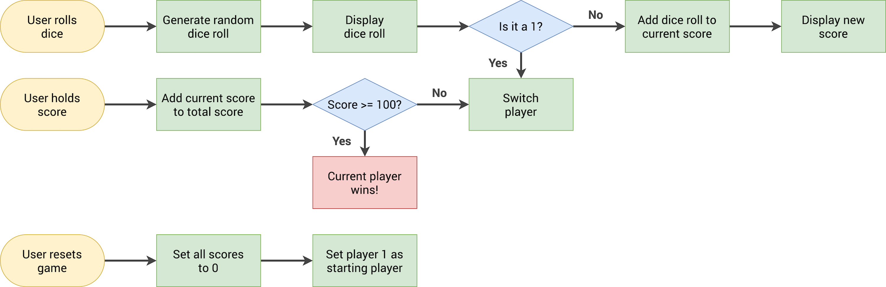

# Pig Game

This folder contains the starter version of the Pig Game. The goal is to build
a two-player dice game using HTML for the interface, CSS for its appearance,
and JavaScript for the game rules and interaction.

## The challenge

Create a game in which two players take turns rolling one six-sided die. A
player's turn score is separate from their total score:

- **Current score** is the number of points accumulated during the current
  turn. It can still change before it is banked.
- **Total score** is the player's saved score from previous turns.
- **Roll dice** generates and displays a die value.
- **Hold** banks the current turn score into the active player's total, then
  passes the turn.
- The first player to reach **100 points** wins.
- Once someone wins, stop accepting rolls and holds, highlight the winner, and
  show a modal with their name.
- **New Game** and **Play Again** reset the game.

### The roll-of-1 rule in this version

The supplied flowchart shows the classic Pig rule: when a player rolls 1, their
turn ends and play passes to the other player without adding the current turn
score to their total.

This starter has a customized rule instead: **when a player rolls 1, bank that
player's current turn score into that same player's total, clear the current
score, and then pass the turn**. The total is still capped at 100. This
customization is reflected in the JavaScript below; the flowchart is included
as the original assignment reference.



## How to play

1. Player 1 starts.
2. Click **Roll dice**. A value from 1 to 6 appears.
3. For values 2–6, add the value to the active player's current score. The
   player can roll again or choose **Hold**.
4. On **Hold**, add the current score to the active player's total and clear
   the current score. If the total is below 100, pass the turn.
5. On a roll of **1**, bank the active player's current score using this
   version's customized rule, clear it, and pass the turn unless that player
   has reached 100.
6. When a player's total reaches 100, the game ends, the total displays as
   exactly 100, and the winner modal appears.
7. Choose **New Game** or **Play Again** to restart.

## Game flow

```text
Page loads / New Game / Play Again
  -> initialize scores, turn, player styles, dice, and modal
  -> Player 1 is active

Roll dice
  -> generate and show a number from 1 to 6
  -> if the result is 2-6:
       add it to the active player's current score
       display the updated current score
       remain on the same player's turn
  -> if the result is 1:
       add the active player's current score to their total (custom rule)
       cap the total at 100 and clear the current score
       if total is 100: finish the game
       otherwise: switch to the other player

Hold
  -> add the active player's current score to their total
  -> cap the total at 100 and clear the current score
  -> if total is 100: finish the game
  -> otherwise: switch to the other player

Finish game
  -> stop accepting rolls and holds
  -> highlight the winner and show their name in the modal
```

## How to build it

### 1. Connect the interface to JavaScript

In `index.html`, each player has a name, a total-score element, and a
current-score element. The buttons and dice image also have classes used by the
script. In `script.js`, `document.getElementById` and `document.querySelector`
get references to those elements so JavaScript can update their text, image,
and CSS classes.

Keep the IDs and classes in the HTML in sync with the selectors in the script.
For example, `score--0` is Player 1's total, while `current--1` is Player 2's
turn score.

### 2. Store the game state

The script uses four state values:

```js
let scores, currentScore, activePlayer, playing;
```

- `scores` is an array: `scores[0]` is Player 1's total and `scores[1]` is
  Player 2's total.
- `currentScore` tracks points accumulated in the active turn.
- `activePlayer` is `0` or `1` and selects the player whose turn it is.
- `playing` is `true` during the game and becomes `false` when someone wins.

The array is the source of truth for totals. After changing it, also update the
matching score element in the page so the displayed total stays in sync.

### 3. Initialize and reset using `init`

`init()` sets the state to `[0, 0]`, clears current scores, selects Player 1,
and sets `playing` to `true`. It also hides the dice and modal and restores
the starting player styles. Call it once when the script loads and from both
restart buttons. Using one function avoids having separate, inconsistent reset
logic.

### 4. Handle a dice roll

Register a click handler on the Roll dice button. Only run the game logic when
`playing` is true. Generate an integer from 1 to 6 with:

```js
Math.trunc(Math.random() * 6) + 1
```

`Math.random()` produces a value from 0 (inclusive) up to 1 (exclusive).
Multiplying by 6 and truncating gives 0–5; adding 1 gives 1–6. Set the dice
image's `src` to the matching file, such as `dice-4.png`.

For 2–6, add the roll to `currentScore` and update the current-score element for
the active player. For 1, call the banking logic and pass the turn if the
banked total did not win.

### 5. Bank points and check for a winner

`bankCurrentScore()` is shared by the roll-of-1 rule and Hold:

1. Add `currentScore` to `scores[activePlayer]`.
2. Use `Math.min(total, 100)` so the displayed total cannot go above 100.
3. Update that player's total-score element.
4. Clear the current turn score and its display.
5. If the total is 100, call `finishGame()` and report that the game ended.

The function returns `true` after a win and `false` otherwise. The caller uses
that result to avoid switching players after a winner has been decided.

### 6. Switch players

`switchPlayer()` changes `activePlayer` from 0 to 1 or from 1 to 0, resets
`currentScore`, clears the current-score displays, and toggles the
`player--active` CSS class. Total scores remain unchanged.

### 7. Finish and restart

`finishGame()` sets `playing` to `false`, hides the dice, applies
`player--winner` styling, copies the active player's name into the winner
modal, and reveals the modal. The `playing` guard in the Roll and Hold event
handlers prevents further gameplay until reset.

Both **New Game** and **Play Again** call `init()`. This restores the initial
state and hides the modal.

## Files

- `index.html` — game interface and the winner modal.
- `style.css` — layout, player states, dice, buttons, and modal appearance.
- `script.js` — game state, dice rolls, score banking, turn changes, win logic,
  and reset behavior.
- `dice-1.png` through `dice-6.png` — images displayed for each die value.
- `pig-game-flowchart.png` — original game-flow reference.

## Run the game

Open `index.html` in a browser. No build step or package installation is
required.
